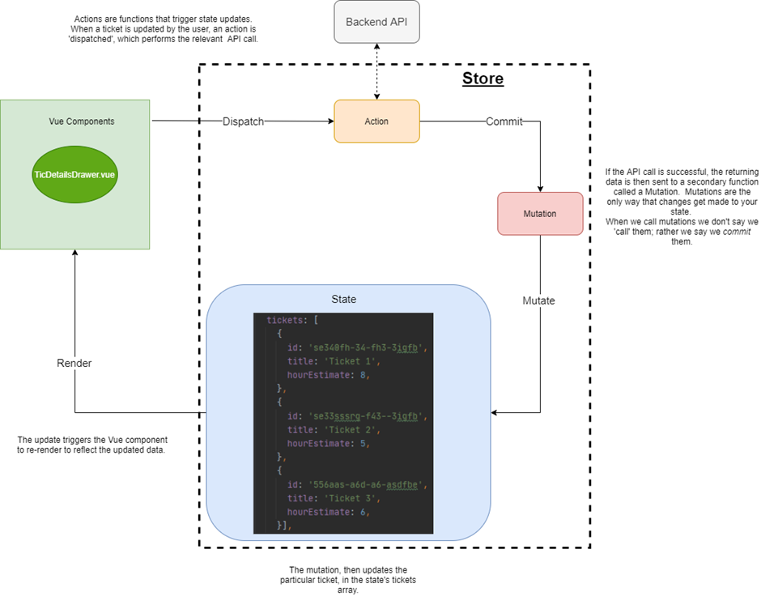
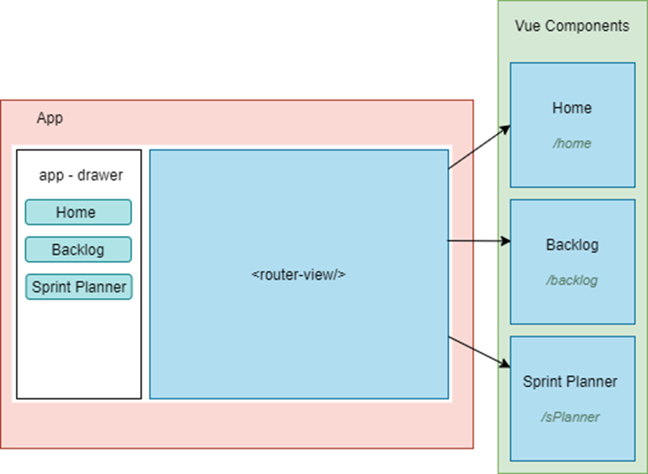
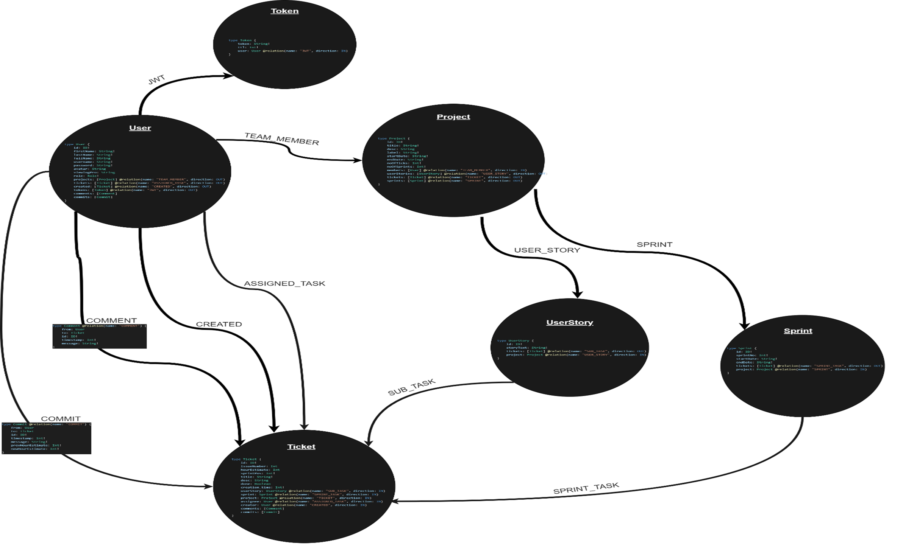
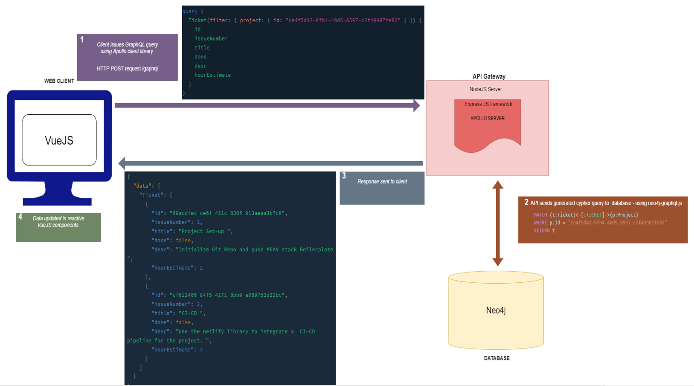
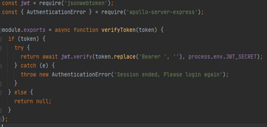
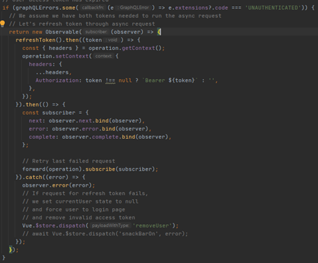
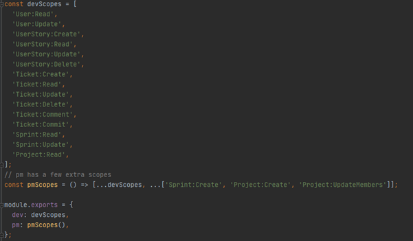
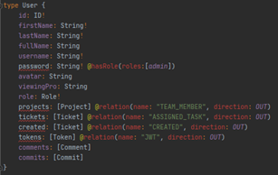

# Caṭulam
Agile Oriented issue tracking solution 

## Project Vision 
Caṭulam is a new approach to tackle problems faced by users of traditional issue tracking software. 

### Project Goals:
* Create a faster and more effective issue tracking board which enables developers to spend less time organizing Tickets/issues.
* Integrate Agile specific tools to aid stand-ups, retros, sprint planning, backlog management.

## Tech Stack
###Client-Side – VueJs

The frontend browser experience required for Caṭulam needs a web application framework
that can support a single page application interface, with ‘reactive’ UI components that keep
track of its reactive data dependencies and re-renders itself. For example, if a user has
updated a ‘ticket,’ the DOM should re-render the ticket without having to re-load the
webpage.

VueJs uses the Model–View–ViewModel (MVVM) pattern. Whereby the View is the actual DOM rendered. The ViewModel is bound to an element in the DOM and provides linkage/interface between Model and View. The model acts as the data access layer, which holds the data/business logic to render in the corresponding element in DOM.

VueJs offers a state management library called Vuex. Often referred to as the ‘store,’ it uses a single state tree (state), which is inherently a global data object, accessible to all components within the application. Components that are bound to the state will be reactive to its data changes. 

Furthermore, the centralized state allows for a reduced number of API calls, because the state simply has to reflect the result of the API calls in its data object, without the need to re-fetch entire datasets from the database. For example, when a user updates a ticket’s ‘estimated hours,’ an API call is made the database. The resulting data passed back to the client doesn’t have to include all the meta-data of the updated ticket. Instead, just it’s ID, and the new value of ‘estimated hours’ will be enough. The store can then precisely update that particular ticket, contained in its state. 

*The store updates are done using a ‘State Management Pattern’*

#### Router – VueJs
 The Caṭulam single page application is made up of several high-level components or ‘pages.’ VueJs provides a router (Vue-Router) that can map components to different routes.
 

The ‘App’ component persists through the entirety of the single page application. This component houses the <router-view />.  This is a functional component that renders the corresponding component for the given path.

For example, when the user clicks on the backlog link, the content of the browser address bar changes to the path ‘/ backlog,’ and the backlog component is injected into <router view/>

Furthermore, Vue-Router provides navigation guards that can help prevent unauthenticated client access by redirecting the requested route if the user is unauthorized. 

###API – Apollo NodeJS server (running on ExpressJS framework)
####ExpressJS

Express is a web application framework for NodeJS. It comes pre-built with features such as cookie parsing, request-body parsing, CORS, and many other features that simplify web-API development.

####Apollo Server

Apollo Server is a server-side implementation of GraphQL Schema. An Apollo server, in other words, exposes data as a GraphQL API that can be queried for data by client applications that send GraphQL queries.
Caṭulams’s API implementation relies on the GraphQL query language to access and manipulate data in the database. It allows clients to call a single endpoint with data requests that specify the type and shape of data required – meaning they receive exactly what they asked for and nothing more. 

###Database – Neo4J 

Caṭulam requires a database instance with the capability of storing multiple data entities and the numerous relationships between them. It should also be possible to query the data and produce results with respect to the relationships. 

A traditional solution to storing highly interconnected data is to use a Relational database management system (RDBMS) such as PostgreSQL. It models data as a set of tables and columns, carrying out complex joins and self-joins when the dataset becomes more inter-related.

Querying such models requires building technically complex queries, which can often turn out to be computationally expensive to run, depending on the data size and ‘interconnectivity.’ 

The data-model of Caṭulam would consist of several interconnected data entities, where relationships are essential, as queries depend on their exploration and exploitation to decipher data. 

Neo4j is used by hundreds of thousands of companies and organizations in almost all industries. Neo4j provides full database characteristics including ACID transaction compliance. 

It also features a powerful query language, Cypher. It is built with a focus on relationships between entities in a data model. Cypher borrows from the pictorial representation of circles connected with arrows which any stakeholder (whether technical or non-technical) can understand. Cypher syntax stays clean and focused on domain concepts since queries are expressed visually. The language is designed to be more intuitive to use.

*Detailed diagram of how the final tech stack works together*
###Authentication used in Catulam 
Upon successful login into the Catualm application the client receives two tokens:

- Access token (valid for 1 hour)
- Refresh token (valid for 7 days)

*Authentication function [./api/src/verifyAndDecodeToken.js](./api/src/verifyAndDecodeToken.js)*

The access token is stored in the client browsers local storage, after it has been received by the client as a response to the login request. It is in fact a json-web-token (JWT).

JWT is called stateless, as no state must be maintained by the authorising server; the token itself is all it takes to validate a token bearer&#39;s authorisation. JWTs are signed using a non-forged digital signature algorithm (e.g. RSA). Anyone who trusts the signer certificate can confidently believe the JWT is authentic.[CITATION jwt20 \l 2057]

The refresh token is a cookie that is set on the browser of the user and is a JWT token as well. This is safe from CSRF attacks, because Javascript cannot read or steal an HttpOnly cookie.

*Vue Apollo client procedure when it receives authentication error [./frontend/src/vue-apollo.js](./frontend/src/vue-apollo.js)*

For every request made by the client, his access token is set as an authentication header in the request. The server validates this token, (if provided) for every GraphQL made.

###<ins>Unauthenticated Token</ins>

When the token is invalid, the server responds with an AuthenticationError object. When the client catches this error in the server response, it automatically runs a refresh token request (API call).

In the refresh token request the server validates the cookie token and responds with a new access token + new refresh token. While the API makes sure to delete the old refresh token in the same request.

The client then retries the query which initially returned the authentication error, with the newly received access token.

However, if the refresh token request was unable to validate the cookie a second AuthenticationError would have been thrown, which will prompt the client to push the browser URL to the logout route and the clears the (access token) localstorage item.

###<ins>JWT Storage</ins>

Every time a refresh token has been issued by the server. The token gets saved into the database as a node related to the user it was issued for. Every time a user makes a logout request, the server makes sure to delete that token from the database.

Therefore, even if a valid JWT refresh token (cookie) is sent by a client, the API has a secondary validation method of checking whether that token exists within the database. This prevents stolen refresh tokens from being used to access the application from clients that have logged out.

Furthermore, the token&#39;s expiry date is saved as a &#39;time-to-live&#39; (ttl) property of the node present in neo4j (database). Any node set with such a property gets automatically deleted at that specified time.

Admittedly, this system is open to a major flaw. That is if a valid refresh token (currently present in the database) gets stolen, the attacker now has full access to application, as he can make refresh token request with the stolen cookie, to gain the access token.

If he does not wait until the expiry date of the refresh token to make a call, he will always be granted new access and refresh tokens.

###<ins>Authentication Scopes</ins>

As an additional authentication measure, the access tokens issued by the API gets a list of scopes set in it is JWT payload. These scopes are dependent on the role of the user.

*Authentication Scopes available to each role [./api/src/authScopes.js](./api/src/authScopes.js)*

All mutations and almost all queries defined in the GraphQL Schema includes a &#39;@hasScope&#39; directive. Every time a user tries to make a GraphQL mutation request API server checks to see if the access token contains the required Scope in the JWT payload. A forbidden access request is thrown if the required Scope is not found.

###<ins>Password validation</ins>

The API uses BcryptJS hashing library to store hashed passwords within the database. When the user tries to login, they check the hash of the password they entered against the hash of their real password (retrieved from the database).

If the hashes match the access is granted to the user. If not, the API throws an error to inform that they have entered invalid login credentials.

Additional security is also added in the form of &#39;@hasRole&#39; directive. The password property of the user type defenetion (found in the API&#39;s Schema). This means that if the password fied gets request in a GraphQL request. The access token JWT, needs to have role value of &#39;adim&#39; within it&#39;s payload.

The role value is set based on the actual role of the user. Currently no admin users can be created via the API therefore the attaining the password field from a GraphQL request is safeguareded agaisnt.

*User type definition [./api/src/schema.graphql](./api/src/schema.graphql)*

